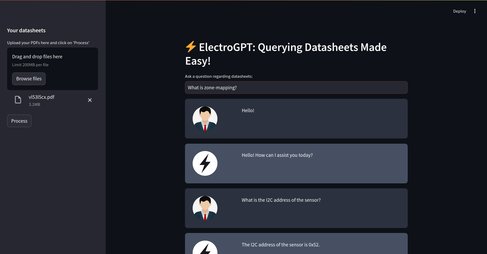

# ElectroGPT: Querying Datasheets Made Easy!



## Introduction
ElectroGPT is chatbot designed specifically to be used to query datasheets for electrical and 
electronic components. Designed to accept multiple PDF datasheet documents as input, ElectroGPT can quickly 
go through the datasheets and extract relevant information reliably. User-friendly and simple UI enables seamless
operation.

## Features
:white_check_mark: Upload multiple PDF files through PyPDF2. <br />
:white_check_mark: Split raw text into text chunks using Langchain Text-Splitter. <br />
:white_check_mark: Create vectorDB and populate with text embeddings uisng Langchain FAISS. <br />
:white_check_mark: Both OpenAI and Hugging Face (Instructor-XL) model implemented for embeddings.  <br />
:white_check_mark: Maintain conversation chain using Langchain.  <br />
:white_check_mark: LLM chat support from OpenAI or Hugging Face models. <br />
:white_check_mark: Streamlit user interface.

## Installation
We recommend using Conda, but you can use any virtual environment of your choice.
If you use Conda, create a new environment with:

```bash 
conda create -n electrogptenv python=3.11
conda activate electrogptenv
pip install -r requirements.txt
```

## Usage
Run the following command to start the ElectroGPT UI in a browser:

```bash 
streamlit run app.py
```

Upload the required PDF datasheets and click the process button once, once
processing is done, ask your questions in the text bar provided.